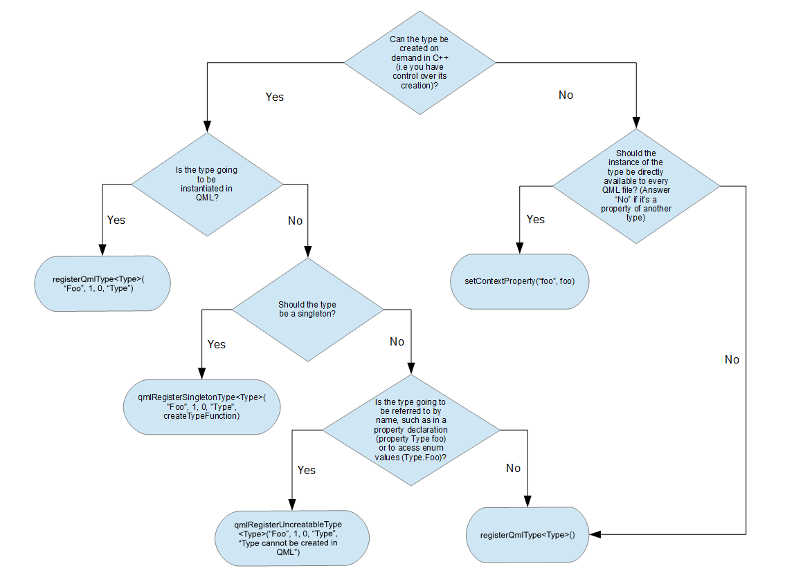
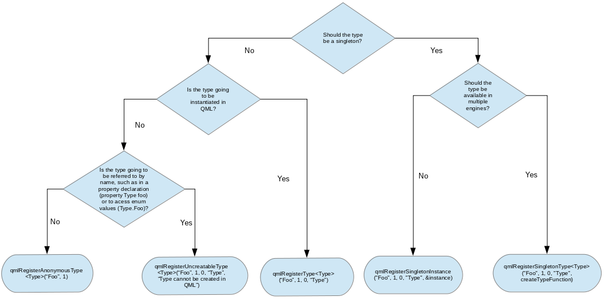

# C++ 與 QML 溝通範例 (QtQML_sample1)

開發環境：Qt 5.12.12

參考以下文件：
* [Integrating QML and C++](https://doc.qt.io/qt-5/qtqml-cppintegration-topic.html)
* [Overview - QML and C++ Integration](https://doc.qt.io/qt-5/qtqml-cppintegration-overview.html)
* [Interacting with QML Objects from C++](https://doc.qt.io/qt-6/qtqml-cppintegration-interactqmlfromcpp.html)

    舊版:

    

    5.15 之後

    

